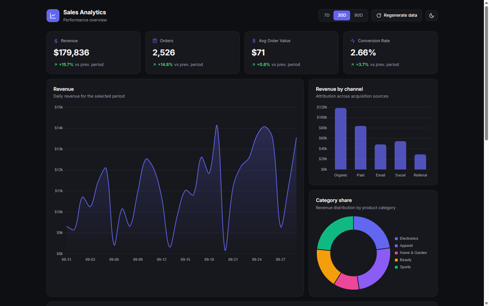

# Дашборд аналитики продаж

Статический дашборд на ванильном JavaScript и Chart.js. Данные демо: их генерирует seeded PRNG (mulberry32) прямо в браузере, поэтому числа детерминированные и воспроизводимые. Бэкенда нет. Вся аналитика поверх этих данных считается по-настоящему: дельты, тренды и атрибуция вычисляются из временных рядов, а не захардкожены.

**Live demo:** [hmsusbusas-png.github.io/metrics-dashboard](https://hmsusbusas-png.github.io/metrics-dashboard/)



## Модель данных

js/data.js строит дневной ряд длиной 2N дней, где N равен выбранному периоду: последние N дней идут на экран, предыдущие N нужны для дельт KPI. Выручка каждого дня раскладывается на пять каналов, у каждого свой профиль:

- Organic: плавный рост, +0.35% к базовой доле за каждый день ряда
- Paid: плато с затуханием, цикл кампании 18 дней, множитель спадает с 1.34 до 0.74 по экспоненте
- Email: пики по вторникам (множитель 1.85), остальные дни 0.82
- Social: выходные вверх (сб и вс 1.5), будни 0.84
- Referral: базовый уровень 0.62 от доли канала, редкие всплески примерно в 5.5% дней (множитель 2.6-5.0)

Сумма каналов дня даёт revenue дня. Дальше orders = revenue / AOV, где AOV гуляет в коридоре $58-84; visitors = orders / conversion, где conversion гуляет в коридоре 2.1-3.3%.

Каждая категория получает фиксированную на сид долю выручки каждого дня (плюс-минус 8% шума). Продукты наследуют выручку своей категории: у каждого своя доля внутри категории, цена, среднее число позиций в заказе и тренд-фактор (растущий около +0.4% в день, стабильный или падающий около -0.4% в день). Дневные продажи продукта = доля продукта × выручка категории за день × тренд в степени номера дня / цена. PRNG задаёт только форму рядов, все метрики на экране вычисляются из них.

## Формулы (js/main.js)

- Revenue за период = сумма дневной выручки
- Orders за период = сумма дневных заказов
- AOV = Revenue / Orders
- Conversion = Orders / Visitors × 100
- Дельта KPI = (текущий период - предыдущий период той же длины) / предыдущий × 100
- Тренд продукта в таблице = (юниты за последние 7 дней периода - юниты за предыдущие 7 дней) / юниты за предыдущие 7 дней × 100
- Bar по каналам и donut по категориям = суммы по дням из того же ряда, из которого считаются KPI

CSV экспортирует ровно те строки, которые видны в таблице, с теми же значениями.

## Что внутри

- KPI-карточки: выручка, заказы, средний чек, конверсия, у каждой дельта к предыдущему периоду той же длины
- Линейный график выручки по дням с градиентной заливкой
- Bar chart по каналам (Organic, Paid, Email, Social, Referral) и donut по долям категорий, оба считаются из дневного ряда
- Таблица топ-продуктов: сортировка кликом по любому заголовку, живой поиск, тренд по последним 7 дням против предыдущих 7
- Фильтр периода 7 / 30 / 90 дней, пересчитываются все виджеты
- Кнопка Regenerate data: новый детерминированный датасет из случайного сида
- Экспорт CSV: выгружает строки, которые сейчас видны в таблице, с учётом активного поиска и сортировки
- Тёмная и светлая темы: переключатель с сохранением в localStorage, учитывает prefers-color-scheme, цвета графиков обновляются на лету

## Как посмотреть

```powershell
# PowerShell, из папки проекта
python -m http.server 8000
# дальше открыть http://localhost:8000
```

Сборки нет, подойдёт любой статический сервер.

## Честно об ограничениях

- Данные ненастоящие: их генерирует mulberry32 (seeded PRNG) в браузере, ничего никуда не отправляется
- Аналитика при этом настоящая: KPI, дельты, тренды продуктов и разбивки по каналам и категориям вычисляются из этих рядов по формулам выше, а не заданы константами
- Chart.js подключён с CDN, без интернета графики не отрисуются
- Авторизации, истории и реальных источников данных нет, это демо

## Структура

```
metrics-dashboard/
├── index.html        # разметка
├── css/style.css     # токены темы и раскладка
├── js/data.js        # seeded PRNG (mulberry32), дневные ряды каналов, категории и продукты
├── js/charts.js      # отрисовка Chart.js, destroy/recreate при обновлениях
├── js/main.js        # состояние, KPI и дельты, тренды продуктов, сортировка и поиск, CSV, темы
├── screenshots/      # desktop.png, mobile.png
└── favicon.svg
```

## Стек

Ванильный JavaScript, Chart.js с CDN, CSS-переменные для тем. Без сборки и зависимостей.

## EN

A static sales analytics dashboard in vanilla JS + Chart.js. Demo data is generated in the browser with a seeded PRNG (mulberry32), deterministic and reproducible, nothing leaves the page. All analytics on top is computed for real from those daily series: KPI deltas compare the period against the previous period of the same length, the product trend is the last 7 days vs the previous 7, and the channel bar and category donut are summed from the same rows. Sortable searchable table, 7/30/90-day filter, CSV export, dark/light theme with localStorage. Open `index.html` or run `python -m http.server 8000`. Live: https://hmsusbusas-png.github.io/metrics-dashboard/
